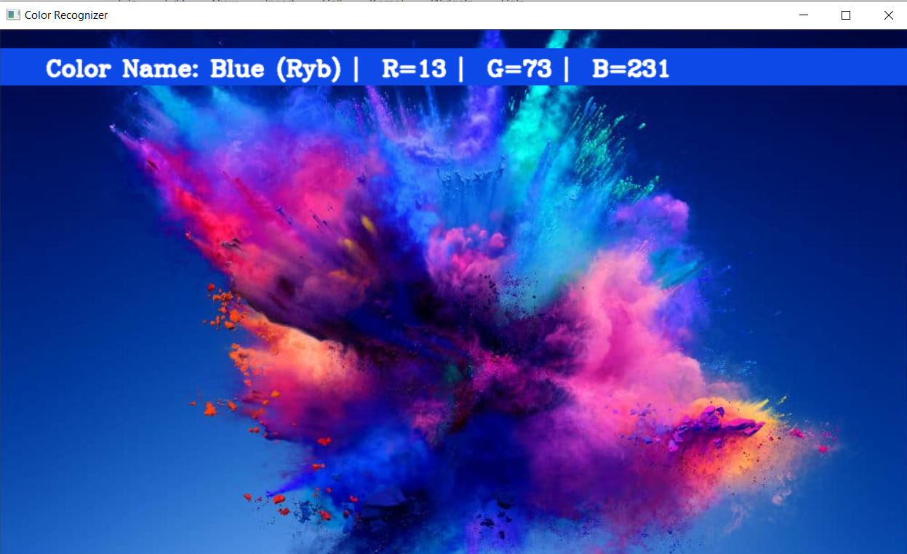
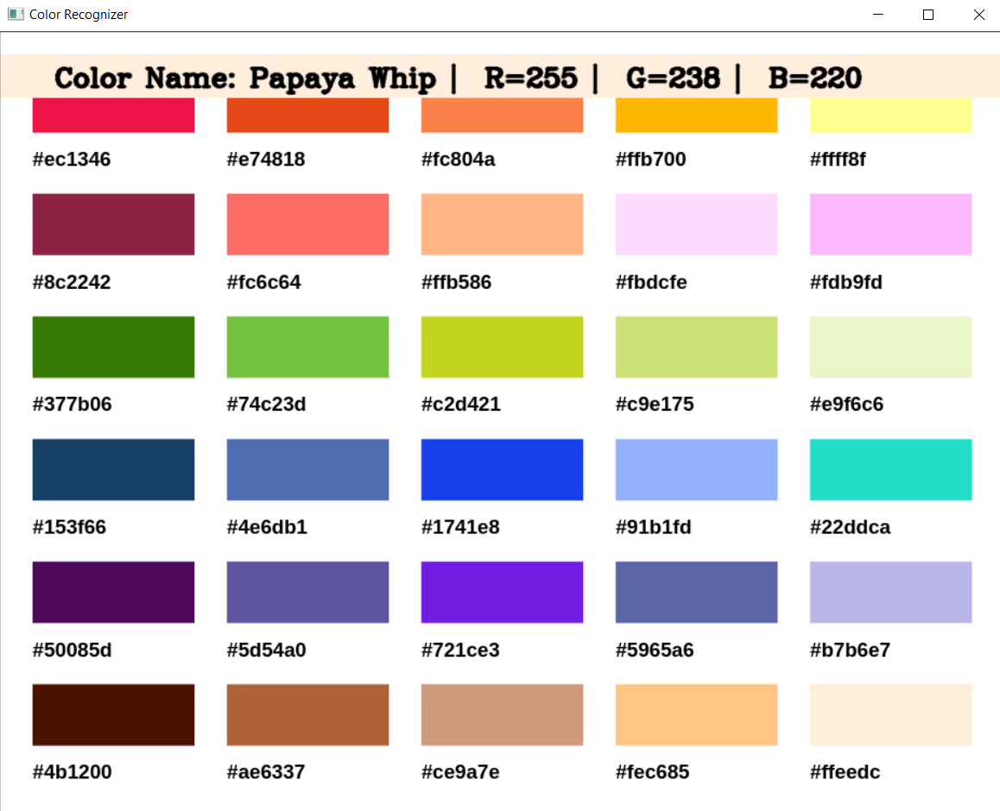
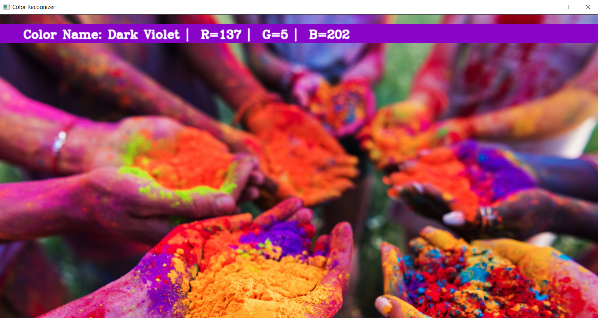
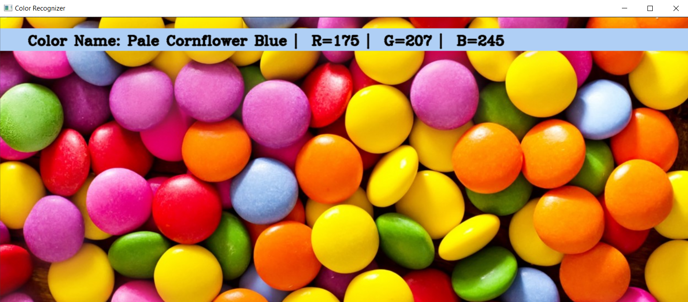
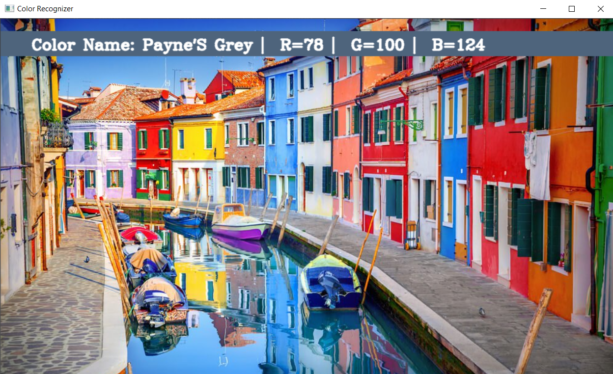

# Color-Recognizer
#### = > This is a Color Detector/Recognizer built using `Opencv`, `Numpy` and `Pandas`.
### Imported Libraries
#### 1. `cv2`
#### 2. `numpy`
#### 3. `Pandas`

### Usage
#### Double Click Mouse Rigth Button by placing pointer on the required color area on Output Window

### Output Window: 

